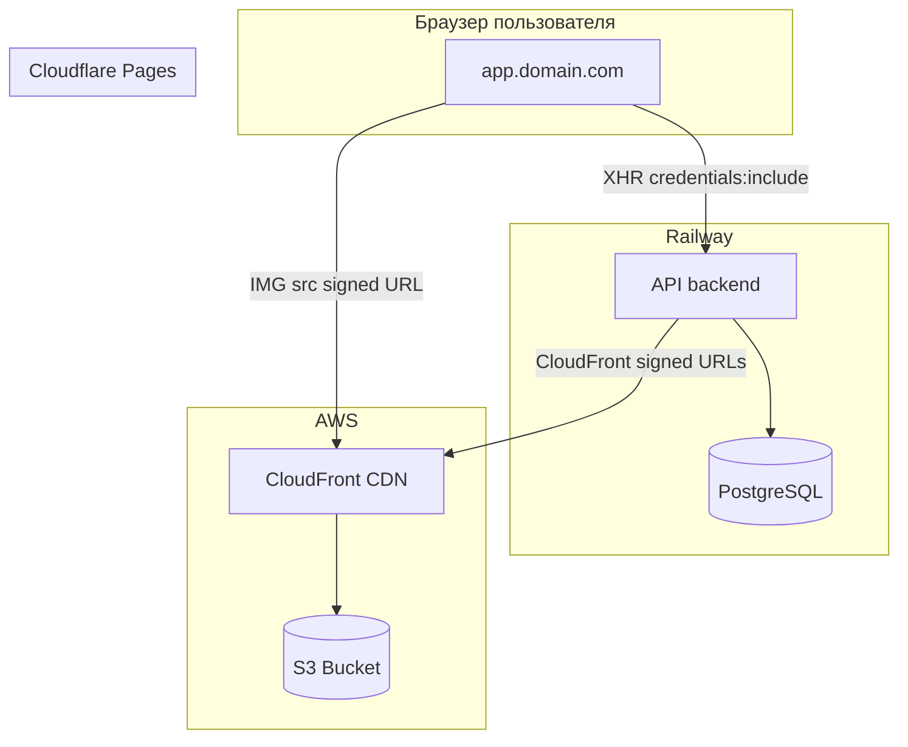

# Задача: CI/CD и Production Deployment

Развернуть приложение Rush Hour Platform по архитектуре: backend на Railway, frontend на Cloudflare Pages, медиа в S3 + CloudFront CDN. Обеспечить работу admin-авторизации (Microsoft OAuth + HttpOnly куки).

## Архитектура

## Предварительные требования (от заказчика)

Исполнителю нужны доступы и данные:

- **Домен**: например `rushhour.com` (или поддомены: `app.rushhour.com`, `api.rushhour.com`)
- **Azure AD**: app registration с redirect URI `https://app.{domain}/admin` (или корень, в зависимости от роутинга)
- **AWS**: IAM пользователь с правами на S3 + CloudFront Key Pair для signed URLs
- **Railway**: доступ к проекту (или инструкция по созданию)
- **Cloudflare**: доступ к аккаунту (или инструкция по созданию)

## Этап 1: S3 и CloudFront CDN

### 1.1 S3 Bucket

1. Создать S3 bucket (например `rush-hour-media`), регион — по требованию (например `eu-central-1`).
2. Bucket: private (без public read).
3. CORS для bucket — разрешить `GET`, `PUT`, `HEAD` от домена фронта (по необходимости).
4. Создать IAM-пользователя с политикой на этот bucket, сохранить `AWS_ACCESS_KEY_ID`, `AWS_SECRET_ACCESS_KEY`.

### 1.2 CloudFront Distribution (CDN)

1. **Создать CloudFront Distribution**:

- Origin: S3 bucket (выбрать bucket из списка).
- Origin Access Control (OAC): создать новый OAC, привязка к distribution.
- После создания — скопировать policy из CloudFront и добавить в S3 bucket policy (доступ только через CloudFront).

1. **CloudFront Key Pair** (для signed URLs):

- AWS Console → Account → Security credentials → Key pairs for CloudFront signed URLs.
- Create key pair → сохранить `Key Pair ID` и PEM файл (приватный ключ).
- Убедиться, что key pair привязан к публичному ключу в CloudFront (автоматически при создании).

1. **Опционально: кастомный домен** — добавить `cdn.{domain}` как Alternate Domain Names в CloudFront, выдать SSL через ACM.

### 1.3 Backend: CloudFront delivery

В коде есть placeholder [cloudfront.go](backend/internal/delivery/cloudfront.go) — **реализация не завершена**. Исполнитель должен:

- Реализовать `CloudFrontDelivery.GetReadURL()` — генерация CloudFront signed URLs (AWS SDK v2 или `crypto/rsa`).
- Подключить `CloudFrontDelivery` в [main.go](backend/cmd/server/main.go) при `MEDIA_DELIVERY=cloudfront`.
- Добавить в [config.go](backend/internal/config/config.go): `CLOUDFRONT_DOMAIN`, `CLOUDFRONT_KEY_PAIR_ID`, `CLOUDFRONT_PRIVATE_KEY`.

Формат signed URL: `https://{domain}/{key}?Expires={}&Signature={}&Key-Pair-Id={}`.

---

## Этап 2: Backend на Railway

### 2.1 Репозиторий и сервис

- Подключить репозиторий к Railway.
- Добавить **Service** → **New → GitHub Repo**.
- Root Directory: `backend`.
- Build: Dockerfile → путь `[backend/Dockerfile.railway](backend/Dockerfile.railway)` (или `[backend/Dockerfile](backend/Dockerfile)`).
- Railway сам подставляет `PORT`.

### 2.2 База данных

- **Add Plugin → PostgreSQL**.
- Railway создаст БД и прокинет `DATABASE_URL` или отдельные переменные (`DB_HOST`, `DB_PORT`, `DB_USER`, `DB_PASSWORD`, `DB_NAME`).
- При необходимости — маппинг в `DB_` (см. [config.go](backend/internal/config/config.go)).

### 2.3 Переменные окружения backend

| Переменная                 | Значение                                | Обязательно       |
| -------------------------- | --------------------------------------- | ----------------- |
| `PORT`                     | (Railway подставит)                     | Да                |
| `DB_HOST`                  | из PostgreSQL plugin                    | Да                |
| `DB_PORT`                  | из PostgreSQL plugin                    | Да                |
| `DB_USER`                  | из PostgreSQL plugin                    | Да                |
| `DB_PASSWORD`              | из PostgreSQL plugin                    | Да                |
| `DB_NAME`                  | из PostgreSQL plugin                    | Да                |
| `DB_SSLMODE`               | `require`                               | Да                |
| `JWT_SECRET`               | случайная строка 32+ символов           | Да                |
| `SUPERADMIN_EMAIL`         | email первого админа                    | Да                |
| `CORS_ALLOWED_ORIGIN`      | `https://app.{domain}`                  | Да                |
| `COOKIE_SECURE`            | `true`                                  | Да                |
| `COOKIE_SAME_SITE`         | `strict` или `lax`                      | Да                |
| `MEDIA_DRIVER`             | `s3`                                    | Да                |
| `MEDIA_DELIVERY`           | `cloudfront` (пусто = s3_presign)       | Да для CDN        |
| `S3_BUCKET`                | имя bucket                              | Да                |
| `S3_REGION`                | регион bucket                           | Да                |
| `AWS_ACCESS_KEY_ID`        | из IAM                                  | Да                |
| `AWS_SECRET_ACCESS_KEY`    | из IAM                                  | Да                |
| `CLOUDFRONT_DOMAIN`        | `xxx.cloudfront.net` или `cdn.{domain}` | Да при cloudfront |
| `CLOUDFRONT_KEY_PAIR_ID`   | Key Pair ID из AWS                      | Да при cloudfront |
| `CLOUDFRONT_PRIVATE_KEY`   | содержимое PEM — секрет                 | Да при cloudfront |
| `MEDIA_SIGNED_TTL_SECONDS` | `3600` (или больше)                     | Опционально       |

### 2.4 Миграции

- После создания PostgreSQL — выполнить миграции один раз.
- Варианты:
  - локально: `make railway-migrate` (по Makefile, ввод данных вручную);
  - или скрипт deploy в Railway: отдельный one-off job, который запускает `go run cmd/migrate/main.go -direction=up`.
- Проверить наличие `cmd/migrate` и использование `DB` или `DATABASE_URL` в коде миграций.

### 2.5 Кастомный домен API

- В Railway: **Settings → Domains** → добавить `api.{domain}`.
- Настроить CNAME в DNS: `api.{domain}` → значение, выданное Railway.

---

## Этап 3: Frontend на Cloudflare Pages

### 3.1 Проект

- **Pages → Create project → Connect to Git**.
- Выбрать репозиторий.
- Settings:
  - **Root directory**: `web`
  - **Build command**: `pnpm install && pnpm build`
  - **Build output directory**: `dist`
  - **Node.js version**: 20 (если доступно)

### 3.2 Переменные окружения (Production)

| Переменная                 | Значение               | Примечание                       |
| -------------------------- | ---------------------- | -------------------------------- |
| `VITE_API_URL`             | `https://api.{domain}` | Обязательно — API для production |
| `VITE_MICROSOFT_CLIENT_ID` | Azure App client ID    | Для OAuth                        |
| `VITE_MICROSOFT_TENANT_ID` | `common` или tenant ID | По настройкам Azure              |

### 3.3 Кастомный домен

- **Custom domains** → добавить `app.{domain}`.
- DNS: CNAME `app.{domain}` → `{project}.pages.dev` (Cloudflare покажет точное значение).

---

## Этап 4: Azure AD и OAuth

1. Открыть **Azure Portal → App registrations**.
2. Добавить **Redirect URI**: `https://app.{domain}/admin` (или корректный путь, куда MSAL возвращает пользователя — см. [AdminMsalProvider.tsx](web/src/pages/Admin/AdminMsalProvider.tsx), там `window.location.origin`).
3. Для SPA: тип **Single-page application**.
4. При необходимости добавить redirect URI для staging/preview (например `https://xxx.pages.dev`), если нужна проверка на preview.

---

## Этап 5: Проверка и документирование

1. **Публичный сайт**

- Открыть `https://app.{domain}` → каталог, карточки, лоты.

1. **Медиа**

- Загрузка изображений в админке.
- Отображение на публичных страницах (presigned S3 URLs).

1. **Admin OAuth**

- Переход на `/admin`.
- Кнопка «Sign in with Microsoft» → редирект на Microsoft → возврат на фронт → POST на `api.{domain}/api/admin/auth/microsoft` → кука `rh_admin_jwt`.
- Проверить в DevTools: наличие HttpOnly куки, что запросы к API идут с `credentials: include` и кука отправляется.

1. **CORS**

- При ошибках CORS — проверить, что `CORS_ALLOWED_ORIGIN` точно равен `https://app.{domain}` (без слэша в конце).

1. **Документация**

- Добавить/обновить `docs/DEPLOYMENT.md` (или аналог) с:
  - списком сервисов и доменов;
  - таблицей env-переменных (backend + frontend);
  - шагами для миграций и повторного деплоя.

---

## Возможные проблемы

- **CloudFront delivery**: Сейчас в коде всегда используется S3 presign ([main.go](backend/cmd/server/main.go) ~457). Для CDN нужна реализация `CloudFrontDelivery` и ветвление по `MEDIA_DELIVERY`. Можно развернуть сначала без CDN (S3 presign), затем добавить CloudFront.
- **Preview deployments (Cloudflare)**: URL вида `xxx.pages.dev` — другой домен, не same-site. Admin auth на preview может не работать. Для тестов — использовать staging-домен (`app-staging.{domain}`).
- **Миграции**: Если в репозитории нет готового deploy-скрипта для миграций, добавить инструкцию или one-off job в Railway.
- **CORS**: Fiber уже использует `AllowCredentials: true` ([main.go:526](backend/cmd/server/main.go)); `AllowOrigins` должен быть одним точным origin.
- **Fiber CORS**: При нескольких origins — проверить, что библиотека поддерживает несколько значений (обычно через запятую). Если нужен только production, достаточно одного origin.

---

## Структура репозитория (без разделения)

Один монорепозиторий. Railway использует `backend/`, Cloudflare Pages — `web/`. Разделять репозиторий не требуется.
