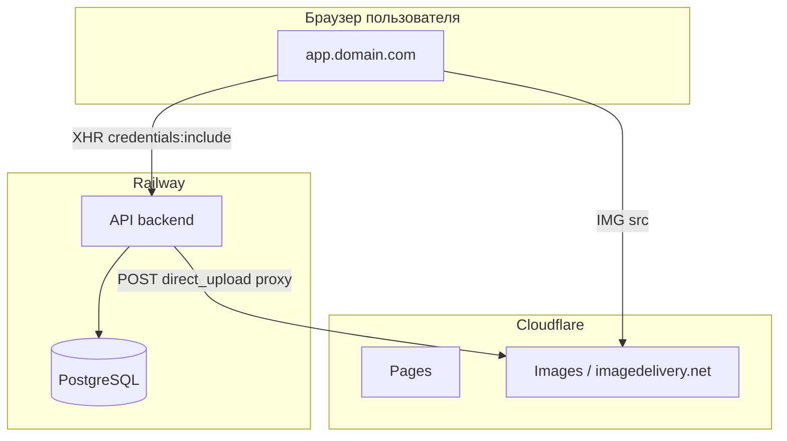

# Задача: CI/CD и Production Deployment

Развернуть приложение Rush Hour Platform по архитектуре: backend на Railway, frontend на Cloudflare Pages, медиа в Cloudflare Images. Обеспечить работу admin-авторизации (Microsoft OAuth + HttpOnly куки).

## Статус выполнения (чек-лист)

- Этап 1: Cloudflare Images
- Этап 2: Backend на Railway (кроме 2.5 домена)
- Этап 3: Frontend на Cloudflare Pages
- Этап 4: Azure AD и OAuth
- Этап 5: Проверка (public, media, admin, CORS)
- Этап 2.5: Кастомный домен API (`api.{domain}`) и финальные CORS/cookie/`MEDIA_PUBLIC_URL`

## Архитектура



## Предварительные требования (от заказчика)

- **Домен**: например `rushhour.com` (или поддомены: `app.rushhour.com`, `api.rushhour.com`)
- **Azure AD**: app registration с redirect URI `https://app.{domain}/admin`
- **Railway**: доступ к проекту
- **Cloudflare**: доступ к аккаунту (Pages + Images)

## Этап 1: Cloudflare Images

### 1.1 Cloudflare Images

1. Cloudflare Dashboard → Images → Enable Cloudflare Images.
2. Создать API Token с правами `Cloudflare Images:Edit`.
3. Скопировать **Account ID** и **Account Hash** (из URL варианта, например `imagedelivery.net/Vi7wi5.../xxx/public` — hash это средняя часть).

### 1.2 Backend env

Backend уже поддерживает `cloudflare_images`:

- `MEDIA_DRIVER=cloudflare_images`
- `CLOUDFLARE_ACCOUNT_ID`
- `CLOUDFLARE_API_TOKEN`
- `CLOUDFLARE_IMAGES_ACCOUNT_HASH`

---

## Этап 2: Backend на Railway

### 2.1 Репозиторий и сервис

- Подключить репозиторий к Railway.
- Добавить **Service** → **New → GitHub Repo**.
- Root Directory: `backend`.
- Build: Dockerfile → путь `[backend/Dockerfile.railway](backend/Dockerfile.railway)` (или `[backend/Dockerfile](backend/Dockerfile)`).
- Railway сам подставляет `PORT`.

### 2.2 База данных

- **Add Plugin → PostgreSQL**.
- Railway создаст БД и прокинет `DATABASE_URL` или отдельные переменные (`DB_HOST`, `DB_PORT`, `DB_USER`, `DB_PASSWORD`, `DB_NAME`).
- При необходимости — маппинг в `DB_` (см. [config.go](backend/internal/config/config.go)).

> TODO (вернуться позже): когда основной домен будет подключён, пересобрать значения CORS / cookie:
>
> - `CORS_ALLOWED_ORIGIN` → `https://app.{domain}` (или список нескольких origins через запятую);
> - при необходимости пересмотреть `COOKIE_SAME_SITE` в зависимости от финальной схемы доменов (поддомены / разные домены).

### 2.3 Переменные окружения backend

| Переменная                       | Значение                      | Обязательно      |
| -------------------------------- | ----------------------------- | ---------------- |
| `PORT`                           | (Railway подставит)           | Да               |
| `DB_HOST`                        | из PostgreSQL plugin          | Да               |
| `DB_PORT`                        | из PostgreSQL plugin          | Да               |
| `DB_USER`                        | из PostgreSQL plugin          | Да               |
| `DB_PASSWORD`                    | из PostgreSQL plugin          | Да               |
| `DB_NAME`                        | из PostgreSQL plugin          | Да               |
| `DB_SSLMODE`                     | `require`                     | Да               |
| `JWT_SECRET`                     | случайная строка 32+ символов | Да               |
| `SUPERADMIN_EMAIL`               | email первого админа          | Да               |
| `CORS_ALLOWED_ORIGIN`            | `https://app.{domain}`        | Да               |
| `COOKIE_SECURE`                  | `true`                        | Да               |
| `COOKIE_SAME_SITE`               | `strict` или `lax`            | Да               |
| `MEDIA_DRIVER`                   | `cloudflare_images`           | Да для prod      |
| `CLOUDFLARE_ACCOUNT_ID`          | из CF dashboard               | Да при CF Images |
| `CLOUDFLARE_API_TOKEN`           | API token CF                  | Да при CF Images |
| `CLOUDFLARE_IMAGES_ACCOUNT_HASH` | из URL варианта               | Да при CF Images |
| `MEDIA_SIGNED_TTL_SECONDS`       | `3600`                        | Опционально      |

### 2.4 Миграции

- После создания PostgreSQL — выполнить миграции один раз.
- Варианты:
  - локально: `make railway-migrate` (по Makefile, ввод данных вручную);
  - или скрипт deploy в Railway: отдельный one-off job, который запускает `go run cmd/migrate/main.go -direction=up`.
- Проверить наличие `cmd/migrate` и использование `DB` или `DATABASE_URL` в коде миграций.

### 2.5 Кастомный домен API

- В Railway: **Settings → Domains** → добавить `api.{domain}`.
- Настроить CNAME в DNS: `api.{domain}` → значение, выданное Railway.

> TODO (на потом): после того как заказчик подготовит домен, вернуться к этому шагу:
>
> - привязать `api.{domain}` в Railway;
> - создать CNAME в DNS на указанный Railway-хост;
> - обновить `CORS_ALLOWED_ORIGIN`, `MEDIA_PUBLIC_URL` и cookie-настройки под боевой домен.

---

## Этап 3: Frontend на Cloudflare Pages

### 3.1 Проект

- **Pages → Create project → Connect to Git**.
- Выбрать репозиторий.
- Settings:
  - **Root directory**: `web`
  - **Build command**: `pnpm install && pnpm build`
  - **Build output directory**: `dist`
  - **Node.js version**: 20 (если доступно)

### 3.2 Переменные окружения (Production)

| Переменная                 | Значение               | Примечание                       |
| -------------------------- | ---------------------- | -------------------------------- |
| `VITE_API_URL`             | `https://api.{domain}` | Обязательно — API для production |
| `VITE_MICROSOFT_CLIENT_ID` | Azure App client ID    | Для OAuth                        |
| `VITE_MICROSOFT_TENANT_ID` | `common` или tenant ID | По настройкам Azure              |

### 3.3 Кастомный домен

- **Custom domains** → добавить `app.{domain}`.
- DNS: CNAME `app.{domain}` → `{project}.pages.dev` (Cloudflare покажет точное значение).

---

## Этап 4: Azure AD и OAuth

1. Открыть **Azure Portal → App registrations**.
2. Добавить **Redirect URI**: `https://app.{domain}/admin` (или корректный путь, куда MSAL возвращает пользователя — см. [AdminMsalProvider.tsx](web/src/pages/Admin/AdminMsalProvider.tsx), там `window.location.origin`).
3. Для SPA: тип **Single-page application**.
4. При необходимости добавить redirect URI для staging/preview (например `https://xxx.pages.dev`), если нужна проверка на preview.

---

## Этап 5: Проверка и документирование

1. **Публичный сайт**

- Открыть `https://app.{domain}` → каталог, карточки, лоты.

1. **Медиа**

- Загрузка изображений в админке.
- Отображение на публичных страницах (imagedelivery.net URLs).

1. **Admin OAuth**

- Переход на `/admin`.
- Кнопка «Sign in with Microsoft» → редирект на Microsoft → возврат на фронт → POST на `api.{domain}/api/admin/auth/microsoft` → кука `rh_admin_jwt`.
- Проверить в DevTools: наличие HttpOnly куки, что запросы к API идут с `credentials: include` и кука отправляется.

1. **CORS**

- При ошибках CORS — проверить, что `CORS_ALLOWED_ORIGIN` точно равен `https://app.{domain}` (без слэша в конце).

1. **Документация**

- Добавить/обновить `docs/DEPLOYMENT.md` (или аналог) с:
  - списком сервисов и доменов;
  - таблицей env-переменных (backend + frontend);
  - шагами для миграций и повторного деплоя.

---

## Возможные проблемы

- **Preview deployments (Cloudflare)**: URL вида `xxx.pages.dev` — другой домен, не same-site. Admin auth на preview может не работать. Для тестов — использовать staging-домен (`app-staging.{domain}`).
- **Миграции**: Если в репозитории нет готового deploy-скрипта для миграций, добавить инструкцию или one-off job в Railway.
- **CORS**: Fiber уже использует `AllowCredentials: true` ([main.go:526](backend/cmd/server/main.go)); `AllowOrigins` должен быть одним точным origin.
- **Fiber CORS**: При нескольких origins — проверить, что библиотека поддерживает несколько значений (обычно через запятую). Если нужен только production, достаточно одного origin.

---

## Структура репозитория (без разделения)

Один монорепозиторий. Railway использует `backend/`, Cloudflare Pages — `web/`. Разделять репозиторий не требуется.

---

## Уточнения и дополнения (code review)

### 6.1 Dockerfile: использовать только `*.railway` варианты

- `**backend/Dockerfile`** — копирует бинарник в `scratch`, но **не включает `/api/openapi.yaml`. Endpoint `/api/openapi.yaml` будет возвращать 404.
- `**backend/Dockerfile.railway` — корректно копирует `openapi.yaml` и обрабатывает `PORT`.
- `**web/Dockerfile.railway` — принимает `VITE_API_URL` как build arg, использует `${PORT}` шаблон для nginx.

**Правило:** всегда использовать `Dockerfile.railway` для обоих сервисов. Обычные `Dockerfile` предназначены только для docker-compose.

### 6.2 `COOKIE_SAME_SITE`: дерево решений для cross-domain

В текущем плане указано `strict` или `lax`, но выбор зависит от топологии доменов:

| Сценарий                                                          | `COOKIE_SAME_SITE` | `COOKIE_SECURE`      | Примечание                                                                                                                |
| ----------------------------------------------------------------- | ------------------ | -------------------- | ------------------------------------------------------------------------------------------------------------------------- |
| Один домен (proxy) — фронт и API на одном origin                  | `lax`              | `true`               | Самый простой вариант                                                                                                     |
| Поддомены одного домена (`app.rush-hour.ae` → `api.rush-hour.ae`) | `lax`              | `true`               | Требуется задать cookie `Domain=.rush-hour.ae` в бекенде (проверить `jwtutil` — сейчас `Domain` может не устанавливаться) |
| Разные домены (например `app.pages.dev` → `api.railway.app`)      | `none`             | `true` (обязательно) | Браузеры не отправят куку при `lax`/`strict` на cross-site XHR                                                            |

**Важно:** `SameSite=Strict` — кука **не отправляется** при cross-origin fetch/XHR. `SameSite=Lax` — отправляется только при top-level navigation (GET), **не при POST/fetch**. Для admin API с `credentials: 'include'` на разных поддоменах без явного `Domain` атрибута — нужен `none`.

**Рекомендация:** проверить код `jwtutil` на предмет установки `Domain` атрибута куки. Если `Domain` не задаётся — добавить env-переменную `COOKIE_DOMAIN` (например `.rush-hour.ae`), чтобы кука была доступна на всех поддоменах.

### 6.3 Health check в Railway

Бекенд имеет endpoint `GET /health` → `{"status":"ok"}` (без авторизации).

- В Railway: **Settings → Deploy → Health Check Path** → `/health`.
- Это предотвратит роутинг трафика на контейнер, который ещё стартует или упал.

### 6.4 Автоматические миграции при деплое

Текущий план покрывает только первоначальный запуск миграций. При каждом новом деплое с новыми миграциями нужен механизм их автоматического применения.

**Рекомендация:** в Railway настроить **Release Command** (Settings → Deploy → Release Command):

```bash
go run cmd/migrate/main.go -direction=up
```

Этот command выполняется **перед** запуском нового контейнера. Если миграция падает — деплой отменяется, старая версия остаётся.

### 6.5 CORS для нескольких origins

`CORS_ALLOWED_ORIGIN` сейчас принимает одну строку. В реальности может понадобиться несколько origins:

- Production: `https://app.rush-hour.ae`
- Staging: `https://staging.rush-hour.ae`
- Preview: `https://xxx.pages.dev`

Fiber `cors.Config.AllowOrigins` поддерживает несколько значений через запятую:

```
CORS_ALLOWED_ORIGIN=https://app.rush-hour.ae,https://staging.rush-hour.ae
```

**Учесть:** при `AllowCredentials: true` wildcard (`*`) запрещён — нужны явные origins.

### 6.6 Seed данных при первом деплое

После миграций на свежей БД нужны начальные данные (города, районы, и т.д.).

- Запустить один раз: `make railway-seed` (Makefile, запрашивает DB credentials, выполняет `psql -f internal/seeds/seed.sql`).
- Или вручную: подключиться к Railway PostgreSQL и выполнить `seed.sql`.
- **Не добавлять seed в Release Command** — он должен выполняться только один раз, не при каждом деплое.

### 6.7 Rollback стратегия

При проблемах после деплоя:

1. **Railway backend:** Deployments → выбрать предыдущий успешный деплой → **Redeploy**. Мгновенный откат.
2. **Cloudflare Pages frontend:** Deployments → выбрать предыдущий билд → **Rollback to this deploy**.
3. **Миграции БД:** `golang-migrate` поддерживает `go run cmd/migrate/main.go -direction=down`. Но откат миграций рискован — тестировать на staging.

**Правило:** всегда деплоить сначала backend (с миграциями), потом frontend. При откате — сначала frontend, потом backend.

### 6.8 Preview deployments: практическое решение

Cloudflare Pages автоматически создаёт preview на `xxx.pages.dev`. Admin auth на них **не будет работать** (другой домен, куки не отправляются).

**Решение:**

- **Для тестирования публичной части** — preview работает без проблем (публичные API не требуют кук).
- **Для тестирования admin** — настроить постоянный staging:
  - Домен: `staging.rush-hour.ae` (CNAME на Pages)
  - Azure AD: добавить `https://staging.rush-hour.ae` в redirect URIs
  - Backend CORS: добавить staging origin через запятую
- **Не пытаться** заставить admin работать на `*.pages.dev` — это создаёт дыру в безопасности.

### 6.9 Мониторинг и observability

| Инструмент                                                                         | Что делает                              | Стоимость                    |
| ---------------------------------------------------------------------------------- | --------------------------------------- | ---------------------------- |
| Railway Logs                                                                       | Встроенные логи бекенда (stdout/stderr) | Бесплатно (в рамках Railway) |
| [Better Stack](https://betterstack.com) или [UptimeRobot](https://uptimerobot.com) | Uptime мониторинг `GET /health`         | Бесплатный tier              |
| [Sentry](https://sentry.io)                                                        | Error tracking (frontend + backend)     | Бесплатно до 5K events/мес   |
| Cloudflare Analytics                                                               | Статистика посещений frontend           | Бесплатно                    |

**Минимум для production:**

- Uptime мониторинг на `/health` с алертами в Telegram/email.
- Sentry на фронтенде для отлова JS-ошибок у пользователей.

### 6.10 `MEDIA_PUBLIC_URL`

Backend config ожидает `MEDIA_PUBLIC_URL` (по умолчанию `http://localhost:8080/api/media`). При использовании `MEDIA_DRIVER=cloudflare_images` URL медиа приходят из `imagedelivery.net`, но переменную стоит явно задать на всякий случай:

```
MEDIA_PUBLIC_URL=https://api.{domain}/api/media
```

Это нужно для fallback-сценариев и для URL подписанных ресурсов.
