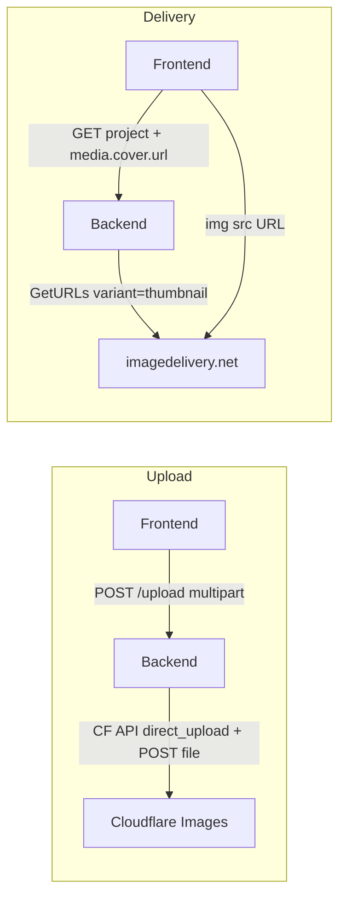

# План перехода на Cloudflare Images

## Текущее состояние

- **Storage:** LocalStorage (dev) / S3Storage (prod)
- **Delivery:** LocalDelivery / S3PresignDelivery
- **Flow:** Init → client PUT to S3 → Complete → GetURLs (presigned)
- **Project/Lot media:** JSON `{ cover: { url }, gallery: [{ url }] }` — хранятся URL
- **Media table:** `storage_key`, `storage_driver` enum: `local`, `s3`

## Выбранная стратегия загрузки: Proxy

**Путь:** Frontend → `POST /upload` multipart → Backend принимает файл → Backend вызывает CF `direct_upload` → Backend POST файла на `uploadURL` → **200 от CF = успех**.

- **200** означает: оригинал принят и сохранён. Варианты (5 размеров) генерируются **on-demand** при первом запросе — не блокируют загрузку.
- Mark ready сразу после 200 — проверка не нужна.
- Init/Complete flow для CF не используем (только при direct creator upload).

---

## Закреплённые решения

| Вопрос          | Решение                                                    |
| --------------- | ---------------------------------------------------------- |
| Ресайз          | Flexible variants + пресеты в OpenAPI YAML (enum + params) |
| API             | A+: base URL, frontend добавляет вариант из shared config  |
| expiresIn       | 0 для CF (URL не истекают)                                 |
| Local + variant | Игнорировать variant, возвращать тот же URL                |
| HeadObject      | Stub (return nil) — не вызывается при proxy                |

---

## Целевая архитектура



## Ресайз: 5 размеров для разных контекстов

| Вариант   | Размер     | Где использовать          |
| --------- | ---------- | ------------------------- |
| thumbnail | 96–200px   | Миниатюры галерей, списки |
| card      | 400px      | ProjectCard, LotCard      |
| medium    | 800px      | Карточки в модалках       |
| hero      | 1200px     | Hero-изображения, галерея |
| full      | без лимита | Полноразмерные, lightbox  |

**Стратегия:** Flexible variants (включить в CF dashboard). Пресеты закреплены в **OpenAPI YAML** — enum `ImageVariant` + параметры для каждого варианта (`x-image-variant-params` или отдельная схема). Backend и frontend подхватывают через генераторы — единый источник истины.

---

## Этап 1: Backend — Cloudflare Images driver

### 1.1 Config

В [backend/internal/config/config.go](backend/internal/config/config.go):

- Добавить `CloudflareImagesConfig`: `AccountID`, `APIToken`, `AccountHash`
- `MEDIA_DRIVER`: добавить `cloudflare_images`
- Env: `CLOUDFLARE_ACCOUNT_ID`, `CLOUDFLARE_API_TOKEN`, `CLOUDFLARE_IMAGES_ACCOUNT_HASH`

### 1.2 Domain

В [backend/internal/domain/media.go](backend/internal/domain/media.go):

- `StorageDriverCloudflareImages StorageDriver = "cloudflare_images"`

### 1.3 CFImagesStorage

Новый файл `backend/internal/storage/cloudflare_images.go`:

- `CreateUploadPolicy`: `POST .../images/v2/direct_upload` → `{ id, uploadURL }`; storage_key = CF id
- `DeleteObject`: `DELETE .../images/v1/{id}`
- HeadObject: stub (return nil) — interface требует метод, при proxy не вызывается

### 1.4 CFImagesDelivery

Новый файл `backend/internal/delivery/cloudflare_images.go`:

- `GetReadURL(ctx, key, expires, variant string)`: возвращает **base URL** `https://imagedelivery.net/{hash}/{key}` (без суффикса варианта)
- Пресеты flexible-параметров — из OpenAPI/конфига, для local driver variant игнорируется

### 1.5 Миграция БД

`backend/internal/migrations/0000XX_add_cloudflare_images_driver.up.sql`:

- Расширить `storage_driver` CHECK: `'local' | 'cloudflare_images'` (S3 удалить)

### 1.6 initMediaService

В [backend/cmd/server/main.go](backend/cmd/server/main.go): ветка `case "cloudflare_images"`

### 1.7 MediaService

- `GetURL` / `GetURLs`: добавить параметр `variant` (или `size`), передать в delivery
- **Upload proxy** (наш путь): при `POST /upload` multipart — вызвать CF direct_upload, POST file на uploadURL, при 200 создать media record как ready. `CompleteUpload` не используется для CF.

---

## Этап 2: API для вариантов

### Решение: A+ (base URL + shared config)

- Backend возвращает **base URL** `https://imagedelivery.net/{hash}/{id}`
- Frontend добавляет суффикс варианта из shared config (OpenAPI → генераторы)
- Один запрос на все размеры, логика пресетов в одном месте

### Текущий API

- `GET /api/media/{id}/url` — один URL
- `POST /api/media/urls` — `{ ids: [] }` → `{ items: [{ id, url, expiresIn }] }`

### Изменения

- **OpenAPI YAML:** enum `ImageVariant`: `thumbnail | card | medium | hero | full` + параметры flexible для каждого (`w=200`, `w=400` и т.д.) — в `x-image-variant-params` или components
- Response: `url` = base URL, `expiresIn` = **0** для CF (URL не истекают)
- Для `local` driver: variant игнорируется, возвращается тот же URL

---

## Этап 3: Frontend — использование размеров

### Места использования (из кода)

| Компонент                | Контекст           | Рекомендуемый размер |
| ------------------------ | ------------------ | -------------------- |
| ProjectCard, LotCard     | превью в каталоге  | card                 |
| MarkerPopup              | миниатюра на карте | thumbnail            |
| ProjectDetail, LotDetail | hero + галерея     | hero, thumbnail      |
| ApartmentCard            | галерея лота       | hero, thumbnail      |
| ProjectsTable, LotsTable | превью в админке   | thumbnail            |
| MediaPicker              | выбор в админке    | thumbnail            |

### Реализация (A+)

Backend отдаёт base URL. Frontend использует хелпер `getImageUrl(baseUrl, variant)` — параметры из сгенерированного типа (OpenAPI enum + конфиг). Пример:

```ts
// Пресеты из OpenAPI / shared config
const VARIANT_PARAMS: Record<ImageVariant, string> = {
  thumbnail: "w=200,fit=scale-down,format=auto",
  card: "w=400,fit=scale-down,format=auto",
  medium: "w=800,fit=scale-down,format=auto",
  hero: "w=1200,fit=scale-down,format=auto",
  full: "",
};
function getImageUrl(baseUrl: string, variant: ImageVariant): string {
  const params = VARIANT_PARAMS[variant];
  return params ? `${baseUrl}/${params}` : baseUrl;
}
```

### srcset для responsive

Для hero/gallery — `srcset` с несколькими размерами (320w, 640w, 960w, 1280w) для экономии трафика.

---

## Этап 4: Удаление S3 и CloudFront

- Удалить: `backend/internal/storage/s3.go`, `backend/internal/delivery/s3_presign.go`, `backend/internal/delivery/cloudfront.go`
- Удалить из config: S3Config, CloudFrontConfig
- Удалить AWS SDK из go.mod (если не используется)
- Обновить [.cursor/plans/ci_cd_deployment_task_7eba6d2a.plan.md](.cursor/plans/ci_cd_deployment_task_7eba6d2a.plan.md) — медиа через CF Images

---

## Этап 5: Обновление документации

- [SPENDINGS.md](SPENDINGS.md) — уже обновлён
- [backend/docs/MEDIA_SERVICE.md](backend/docs/MEDIA_SERVICE.md) — CF Images driver, env, варианты
- CI/CD план — заменить S3+CloudFront на CF Images, env vars

---

## Порядок реализации

| #   | Задача                                           | Зависимости |
| --- | ------------------------------------------------ | ----------- |
| 1   | Config + domain                                  | —           |
| 2   | Миграция БД                                      | —           |
| 3   | CFImagesStorage                                  | 1           |
| 4   | CFImagesDelivery (с variant)                     | 1           |
| 5   | initMediaService                                 | 2, 3, 4     |
| 6   | Upload handler proxy для CF (200 = ready)        | 3           |
| 7   | — CompleteUpload не нужен при proxy              | —           |
| 8   | API: параметр variant в GetURL/GetURLs           | 4           |
| 9   | Frontend: хелпер getImageUrl, использование size | 8           |
| 10  | Удалить S3, CloudFront                           | 5           |
| 11  | Обновить docs, CI/CD план                        | —           |
